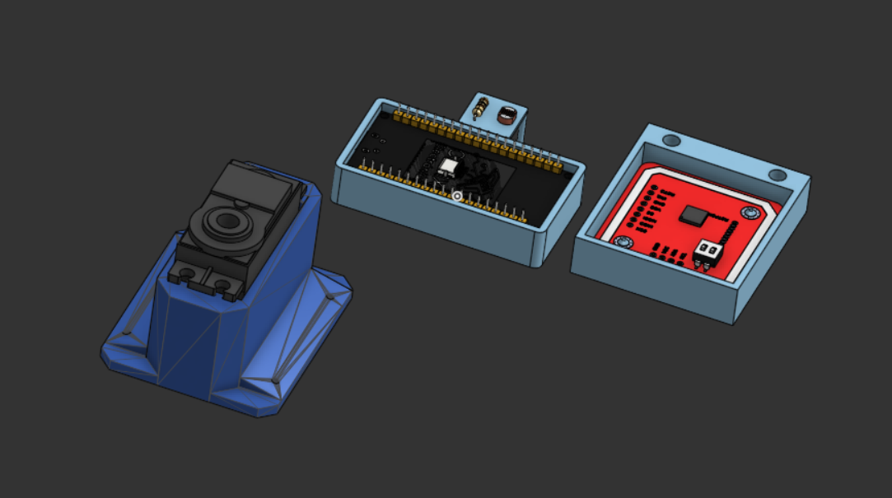
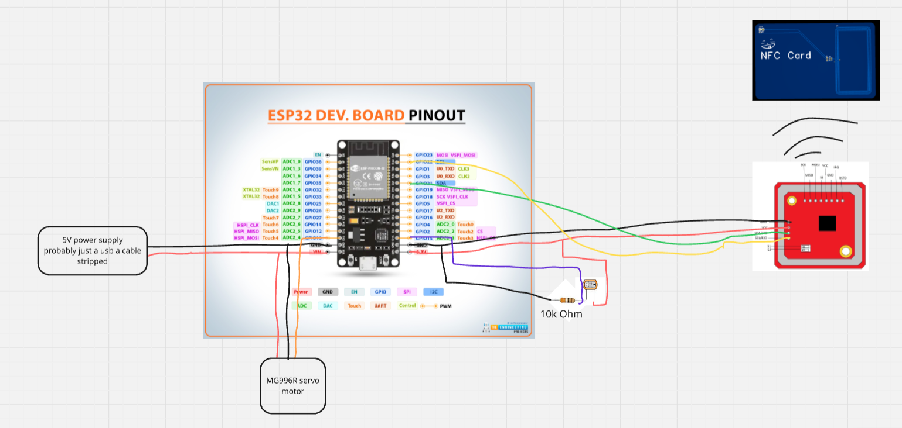

# Desk-Lock

A cheap desk lock that unlocks with an NFC card.

## Overview

This project is a DIY desk lock which keeps items in your desk secure by using a NFC reader. An ESP32 reads an NFC card via a PN532 module and controls a servo motor that locks or unlocks the desk. A photoresistor is used to detect when the drawer is closed so it can relock automatically.

[Detailed Description Here](#Detailed-Description)

## Motivation

I wanted a secure way to lock my desk because I keep important items inside and my little brother cannot be trusted with it. Buying a commercial lock felt boring and expensive, so building one with NFC was more interesting and let me design my own NFC card and reader.

## Parts List (Bill of Materials)

- 1x of [Photoresistor](https://www.aliexpress.us/item/3256805782399608.html), TYPE 5528, PRICE $2.39
- 1x of [10k Resistor](https://www.aliexpress.us/item/2251832766343175.html), TYPE 10K, PRICE $1.25
- 1x of [MG996R Servo](https://www.aliexpress.us/item/3256808293405785.html), TYPE N/A, PRICE $0.99
- 1x of [AC to DC Power Supply](https://www.aliexpress.us/item/3256806901002886.html), TYPE US Plug/DC 5V/4A, PRICE $4.60
- 1x of [ESP32 Development Board](https://www.aliexpress.us/item/3256805767190776.html), TYPE 1PCS-CP2102 TYPE-C, PRICE $6.56
- 1x of [PN532 NFC Module](https://www.aliexpress.us/item/3256806852006648.html), TYPE PN532, PRICE $3.67

### NFC Card - 25.33 for 5

| Schematic                                     | PCB                               | 3D View                         |
| --------------------------------------------- | --------------------------------- | ------------------------------- |
|  |  |  |

## Detailed Description

This project is a DIY NFC-based desk lock using an ESP32. A PN532 NFC reader communicates with the ESP32 over I2C to read NFC cards. When an authorized card is detected, the ESP32 drives a servo motor to unlock the drawer. Unauthorized cards are ignored. 
The servo is powered by an external supply that also powers the ESP32 and is mounted so one position locks the drawer and another unlocks it. The mechanical design is flexible and can support different desk types. 
A photoresistor inside the drawer is wired as a voltage divider with a 10 kΩ resistor and connected to an ESP32 ADC pin. It detects whether the drawer is open or closed based on light level. After unlocking, the system waits until the drawer is closed (becomes dark), then automatically relocks after a configurable delay (default 10 seconds).

## Example Placement Diagram
Here is an example placement diagram for the servo:

#
